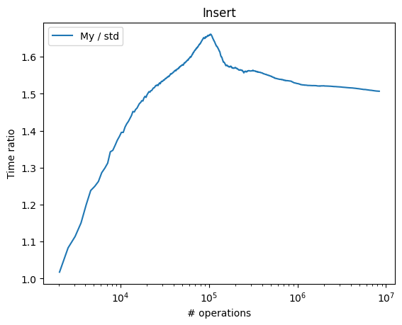
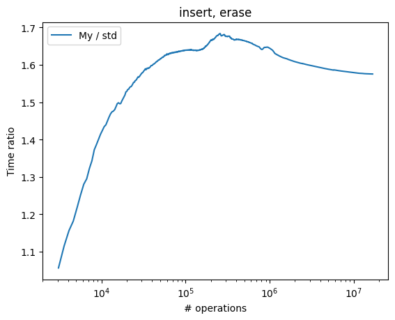

# set-implementation
This is properly tested `std::set` implementation, based on self-balansing AVL-tree. 

It supports standart `std::set` operations in guaranteed `O(log(n))`.

# Benchmarks
Benchmark was compiled with `g++ -std=c++17 -O2`.

## Insert

About `1.5` times slower.

## Insert erase

About `1.6` times slower.

## Lower_bound

About `3%` faster in average.

## Memory
Memory difference is negligible (less than `0.03 MB` per `1e6` elements), which is understandable due to equal amount of information, storing in each node (left, right child pointers, parent pointer, and data themselves).
